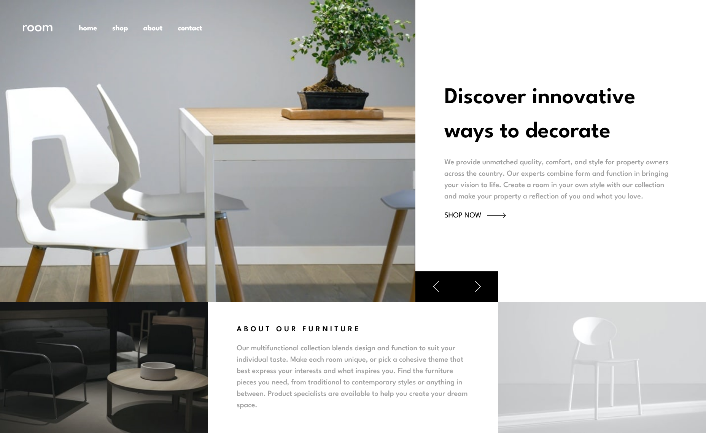

# Frontend Mentor - Room homepage solution

This is a solution to the [Room homepage challenge on Frontend Mentor](https://www.frontendmentor.io/challenges/room-homepage-BtdBY_ENq). Frontend Mentor challenges help you improve your coding skills by building realistic projects.

## Table of contents

- [Overview](#overview)
  - [The challenge](#the-challenge)
  - [Screenshot](#screenshot)
  - [Links](#links)
- [My process](#my-process)
  - [Built with](#built-with)
  - [What I learned](#what-i-learned)
  - [Continued development](#continued-development)
  - [Useful resources](#useful-resources)
- [Author](#author)
- [Acknowledgments](#acknowledgments)

## Overview

A complete design of the Room HomePage provided by Frontend Mentor.

### The challenge

Users should be able to:

- View the optimal layout for the site depending on their device's screen size
- See hover states for all interactive elements on the page
- Navigate the slider using either their mouse/trackpad or keyboard

### Screenshot

### Links

- Solution URL: [GitHub Repo](https://github.com/OIDemi/room-webpage)
- Live Site URL: [Live Site](https://landingpage-room.netlify.app/)

## My process

### Built with

- Mobile-first workflow
- [React](https://reactjs.org/) - JS library
- [Tailwind CSS](https://tailwindcss.com/)

### What I learned

This challenge helped me practice more on my Bento Grid skills.

## Author

- Frontend Mentor - [@OIDemi](https://www.frontendmentor.io/profile/OIDemi)
- Twitter - [@i_amoj](https://www.x.com/i_amoj)
